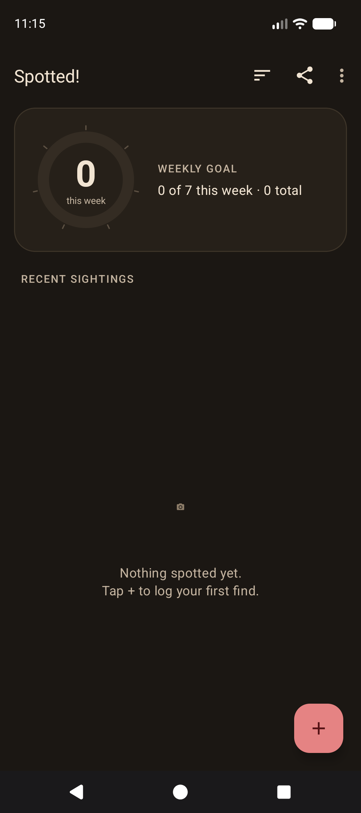
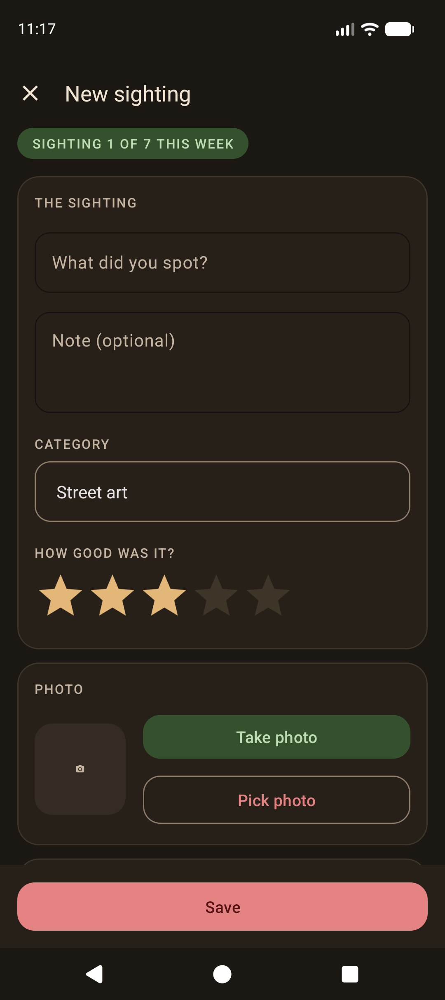
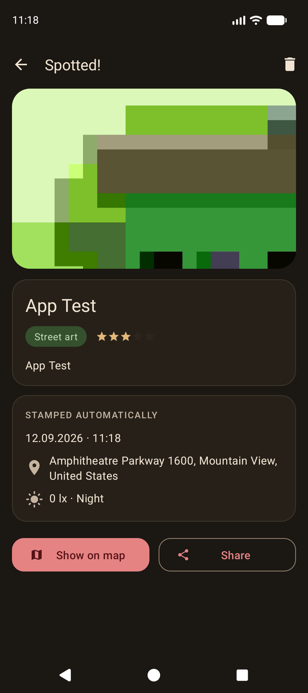
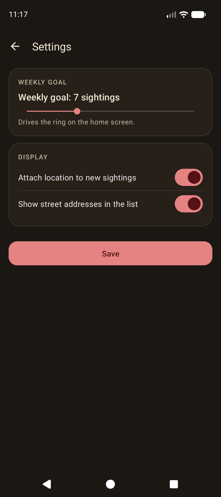

# Spotted!

A field logbook for Android. You log what you spotted — a title, a note, a category, a 0–5 star
rating and a photo — and the app stamps the entry with where you were and how bright it was, so
the record writes half of itself.

Kotlin, XML views, framework APIs only. No Room, no Glide, no Retrofit, no Play Services — the
constraint is deliberate, and everything below is the platform SDK plus Material Components.

---

## Screenshots

| Gallery | New sighting | Detail | Settings |
|---|---|---|---|
|  |  |  |  |

---

## What it does

- **Log a sighting** — title, note, category, star rating, and a photo taken with the camera or
  picked from the gallery.
- **Two sensors, read automatically.** `LocationManager` supplies the GPS fix, which `Geocoder`
  reverse-geocodes into a street address; the ambient light sensor supplies lux, bucketed into
  Night / Dusk / Indoor / Daylight.
- **A weekly goal ring.** A custom `View` draws a donut: a progress arc for the week, tick marks
  for each sighting in the goal, an inner arc for the share logged at night, and the count in the
  middle. It animates whenever the data changes.
- **A gallery** of past sightings in a `RecyclerView`, sortable by date or by rating.
- **Share and map out** any sighting — `geo:` to a map app, `ACTION_SEND` for the text.
- **Settings** that stick: weekly goal, whether to attach location, whether to show addresses.
- **Light and dark**, both hand-tuned rather than inherited from the Material template.

## Architecture

Four activities, no ViewModels, no dependency injection — at this size they'd be ceremony. State
lives in two Kotlin `object`s and travels between screens as activity results:

- `SightingStore` owns every read and write. Sightings are a JSON array inside a single
  SharedPreferences string; three settings sit beside it. Corrupt JSON returns an empty list
  rather than throwing, so a bad write can't brick the app on launch.
- `PhotoStorage` owns photo files — copying picked or captured images into `filesDir/photos`,
  decoding them at display size with `inSampleSize`, and deleting them when a sighting goes.
- `AddSightingActivity` returns a new `Sighting`; `DetailActivity` returns the id of a deleted
  one. `MainActivity` holds the launchers and refreshes in `onResume`.

## Tech

- **Kotlin**, XML layouts, no Compose
- `minSdk 34` · `targetSdk 36` · `compileSdk 36`
- Gradle Kotlin DSL, AGP 9.x via the version catalog
- Dependencies: `core-ktx`, `appcompat`, `material`, `activity-ktx`, `constraintlayout`
  (RecyclerView arrives transitively through Material)

## Project structure

```
app/src/main/
├── java/com/example/spotted/
│   ├── MainActivity.kt          gallery, ring, toolbar menu, three result launchers
│   ├── AddSightingActivity.kt   both sensors, permissions, camera + gallery
│   ├── DetailActivity.kt        one sighting, map / share / delete
│   ├── SettingsActivity.kt      SharedPreferences round trip
│   ├── SightingsRingView.kt     the custom weekly-goal ring
│   ├── SightingAdapter.kt       RecyclerView adapter
│   ├── Sighting.kt              Serializable data class + lux thresholds
│   ├── SightingStore.kt         all persistence
│   └── PhotoStorage.kt          copy, downsample and delete photo files
└── res/
    ├── layout/                  four activities + one list row
    ├── values/                  colors · themes · styles · strings · attrs
    ├── values-night/            dark overrides
    ├── drawable/                vector icons and shape backgrounds
    └── xml/file_paths.xml       FileProvider path for camera captures
```

## Building

1. Clone and open the folder in **Android Studio** (Ladybug or newer). Let it sync.
2. Create an emulator: **API 36 Pixel with a Google APIs system image.** The plain AOSP image has
   no Play services, so `Geocoder` returns nothing and every address comes back empty.
3. Run.

### Driving the sensors on an emulator

Both sensors are simulated from **Extended Controls** (the `…` button beside the emulator):

- **Location** — set a fixed lat/lon and press *Send*, or play a `.gpx` route.
- **Virtual sensors → Additional sensors → Light** — drag the lux slider and watch the bar and
  the Night/Dusk/Indoor/Daylight label follow it. The thresholds are 12, 60 and 800 lx.
- **Camera** — the back camera defaults to the emulated scene; switch it to a webcam here if you
  want real photos.

Geocoding needs a network connection as well as the Google APIs image.

## Notes on some of the decisions

- **The ring reads its colours from the theme**, via
  `context.theme.obtainStyledAttributes(intArrayOf(attr))` with
  `com.google.android.material.R.attr.*` constants — `nonTransitiveRClass` (the AGP 8+ default)
  keeps library attributes out of the app's own `R`. Its gradient highlight is
  `ColorUtils.blendARGB(ringColor, WHITE, 0.38f)`, derived from whatever accent the theme
  supplies rather than a second hardcoded hue.
- **Camera capture needs no `CAMERA` permission.** The app never opens the camera itself; it
  hands `ACTION_IMAGE_CAPTURE` a file to fill. Declaring the permission is what would force a
  runtime request. The file travels as a `content://` URI through `FileProvider`, because a
  `file://` URI has thrown `FileUriExposedException` since Android 7.
- **Picked photos are copied into internal storage** rather than referenced by URI: a picked
  `content://` URI only carries a temporary permission grant, which would be gone by the next
  launch.
- **`getSerializableExtra(name, Class)`** is used over the one-argument overload, deprecated since
  API 33 because it deserialised before the type could be checked.
- **`Geocoder.getFromLocation(…, GeocodeListener)`** runs off the main thread; the pre-33 path
  wraps the blocking overload in a `thread { }` and hops back with `runOnUiThread`.
- **The light bar is log-scaled** — `log10(lux + 1) / log10(100000)` — because lux is
  perceptually logarithmic and a linear 0–100k bar sits at zero indoors.

## Design

A warm palette rather than the Material template default: softened red `#BD4444` on cream
`#F1DEC4` in light, `#E58383` on warm charcoal `#1B1713` in dark, with sage greens for the
secondary roles. The app bar sits on the page colour and the accent is spent on the things you
can press. Type and component shape live in `styles.xml`; every layout references theme
attributes, never raw colours.

## Licence

MIT — see [LICENSE](LICENSE).